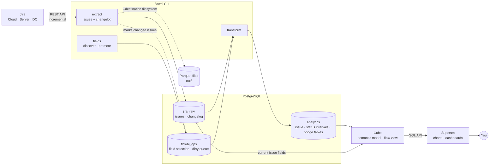

# OpenFlowBI

Self-hosted flow metrics for Jira: cycle time, time in status and throughput, from your own copy
of Jira's full history.

[](https://github.com/sunishbharat/open-flow-bi/actions/workflows/ci.yml)
[](LICENSE)
[](https://www.python.org/downloads/)

<!--
  Screenshots still need to be added. Create docs/img/dashboard.png (a Superset dashboard) and
  docs/quickstart.gif (a recording of scripts/quickstart.sh), then uncomment these two lines:


-->

- **Cycle time and time in status**, rebuilt from every issue's complete changelog, so you can ask
  how long work really spent in each status.
- **Incremental sync:** after the first load, each run fetches only what changed in Jira.
- **Self-hosted:** your Jira data goes into your own Postgres and never leaves your machine.
- **No per-seat cost:** open source (MIT), built on Postgres, Cube and Apache Superset.
- **Works with Jira Cloud and Jira Server / Data Center.**

## Get started

One script installs everything and walks you through setup. No coding needed: you answer a few
questions and end up with a dashboard in your browser.

### What you need

- **Docker Desktop**, installed and running:
  [download it here](https://www.docker.com/products/docker-desktop/). Leave it open while you
  install and use OpenFlowBI.
- **Windows only: Git for Windows**, from [git-scm.com](https://git-scm.com/download/win). It adds
  the "Git Bash" window the script runs in. macOS and Linux already have a terminal that works.
- **Your Jira details:**
  - **Jira Cloud** (an address ending in `.atlassian.net`): your account email and an API token.
    See [Jira Cloud](docs/configuration.md#jira-cloud-atlassiannet) for how to create one.
  - **Jira Server or Data Center** (your company's own Jira): a personal access token, from your
    Jira profile → Personal Access Tokens.
  - **No Jira yet?** Keep the defaults the script offers. It then uses Apache's public Jira, which
    needs no account, so you can try everything first.

### Install

1. **Download OpenFlowBI.** On [the GitHub page](https://github.com/sunishbharat/open-flow-bi),
   click **Code → Download ZIP** and unzip it. Or, if you use git:

   ```bash
   git clone https://github.com/sunishbharat/open-flow-bi.git
   ```

2. **Open a terminal in that folder** (`open-flow-bi`, or `open-flow-bi-main` from a ZIP).
   - **Windows:** right-click the folder → **Open Git Bash here** (on Windows 11, first click
     **Show more options**).
   - **macOS:** open **Terminal**, type `cd ` (with a space), drag the folder into the window, and
     press Enter.
3. **Run the installer:**

   ```bash
   bash scripts/quickstart.sh
   ```

4. **Choose how to install.** The script shows one menu:
   - **Install with defaults** uses the Jira in `.env` and loads 50 issues. Out of the box that's
     Apache's public Jira, so nothing else is asked. If `.env` has no Jira address or token, the
     script asks for those (and, for Jira Cloud, your email). The token isn't shown as you type;
     that's normal.
   - **Customize** asks about everything: your Jira address, project key, Jira type and token,
     where the application image comes from (the one already on this machine, a prebuilt download,
     or a build from source), and how many issues to load (50, 500, all, or a number). Start with
     50 to check that everything works; you can load the rest later.
   - **Cancel** stops without changing anything.

   Pick an option with the arrow keys and Enter, or type its number. After that the script runs on
   its own, one line per task. If you stop it, run it again later and it picks up where it left off.
   With [gum](https://github.com/charmbracelet/gum) installed the menus look nicer, but it's
   optional.
5. **Log in.** When the script finishes, it shows a box with the dashboard link,
   `http://localhost:8088`, the user name (`admin`), where the password is saved
   (`SUPERSET_ADMIN_PW` in `.env`), and a `postgresql://...@cube:15432/db` line you'll need next.
   Superset can take a few minutes to start the first time.

### Show your data (once)

The first time, Superset needs to be told where your data is:

1. In Superset, go to **Settings → Database Connections → + Database → PostgreSQL**.
2. Click **Connect this database with a SQLAlchemy URI string instead**, and paste the
   `postgresql://...@cube:15432/db` line the script printed. Click **Test Connection**, then
   **Connect**.
3. Go to **Datasets → + Dataset**, and choose that database, schema `public`, table `flow`.
4. Go to **Charts → + Chart → Bar Chart**, set the X-axis to `status_name` and the metric to
   `count` (aggregate MAX), then click **Update chart**. Save it to a new dashboard.

[docs/dashboard.md](docs/dashboard.md) shows more charts, such as cycle time and time in status.

### Later

| To... | Do this |
|---|---|
| Load new and changed issues from Jira | Run `bash scripts/quickstart.sh` again. It only fetches what changed |
| Load all issues, not just 50 | Run `bash scripts/quickstart.sh --limit 0`. A large project can take hours |
| Stop OpenFlowBI | Run `docker compose stop` in the same terminal, or in Docker Desktop: **Containers** → the folder's name → stop |
| Remove everything, including the data | Run `docker compose --profile tools down -v` in the same terminal |

### If something goes wrong

The script stops with a message saying what failed and what to try. Every command's full output is
saved in `.quickstart.log` in the same folder, which helps if you ask someone for help. The most
common problems:

| Message | What to do |
|---|---|
| "Docker isn't running" | Start Docker Desktop, wait until it says it's running, then run the script again |
| `CERTIFICATE_VERIFY_FAILED` | Your antivirus or company network inspects secure connections. Install [uv](https://docs.astral.sh/uv/getting-started/installation/), delete the file `.build-ca.pem` in the folder, and run the script again |
| "Couldn't reach Jira" | Check the Jira address and token: run the script again, choose **Customize**, then **Change them** under "Jira settings" |
| Superset's **Test Connection** fails | Paste exactly the `postgresql://...@cube:15432/db` line the script printed. Don't use `localhost` |

[docs/troubleshooting.md](docs/troubleshooting.md) covers more.

## How it works



| Stage | Command | What happens |
|---|---|---|
| **1. Extract** | `flowbi extract issues` / `extract changelog` | Pulls new and changed issues and their full status history from Jira into `jira_raw`. Loads are incremental and safe to re-run. Changed issues are queued for the next transform. |
| **2. Choose fields** | `flowbi fields discover` / `promote` | Measures how often each Jira field is filled in, then records which ones to turn into real columns. Every change is versioned. |
| **3. Transform** | `flowbi transform` | Rebuilds only the queued issues into `analytics`: one row per issue with your promoted columns, plus one row per status period for cycle time. Jira isn't called again. |
| **4. Model** | Cube (`cube/model/`) | Turns the tables into named dimensions and measures, exposed together as one `flow` view. |
| **5. Explore** | Superset | Build charts and dashboards in the browser without writing SQL. |

## Features

- Extracts Jira issues and their complete changelog history, from Jira Cloud and Server/Data Center
- Incremental syncs: a re-run only fetches what changed since the last one
- Loads into Postgres with idempotent merges and data-quality checks, or into local Parquet files
- Discovers which of Jira's (often 200+) fields are actually filled in, lets you select them with a
  versioned, auditable decision log, then turns them into real Postgres columns without calling
  Jira again
- Builds each issue's status history from the changelog (time in status, cycle time), starting
  correctly at the issue's creation even though Jira's changelog only records transitions
- A Cube semantic model and a Superset dashboard for building charts without writing SQL

## Documentation

| Guide | What's in it |
|---|---|
| [Configuration](docs/configuration.md) | Environment variables; connecting Jira Cloud, Server and Data Center; mTLS client certificates; TLS-inspecting proxies |
| [CLI reference](docs/cli.md) | Every `flowbi` command; field discovery and promotion; extracting several projects |
| [Docker](docs/docker.md) | What the quickstart script does, the same steps by hand, and starting over |
| [Dashboard](docs/dashboard.md) | Connecting Superset to Cube, and example charts |
| [Development](docs/development.md) | Running from source, testing, adding a field to the dashboard, inspecting raw output |
| [Troubleshooting](docs/troubleshooting.md) | Common errors and fixes |
| [Cube model](cube/README.md) | The semantic model and its modeling rules |

## Roadmap

- A browser screen for choosing which Jira fields to promote, over the same engine as
  `flowbi fields`
- Row-level security, so several users can each see only their own Jira projects
- Prebuilt images on a public registry, so installing doesn't need a clone
- Deployment beyond a single machine (today the stack runs under Docker Compose)

## Contributing

Contributions are welcome. See [CONTRIBUTING.md](CONTRIBUTING.md) for setup, the checks to run, and
what a pull request needs.

## License

OpenFlowBI is released under the [MIT License](LICENSE).
